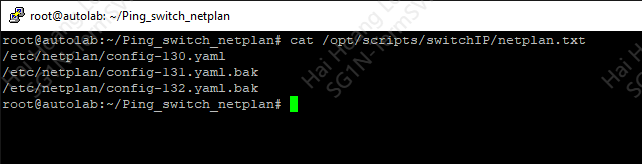

# If unreachable then apply other netplan


Clone to local:
```bash
git clone https://github.com/hhai-le/Ping_switch_netplan.git
```

install script to your location:
```bash
cd Ping_switch_netplan
bash install_switchIP_new.sh /path/to/script
```

In my example, I installed at **/opt/scripts/switchIP**:


the script will create 4 files:

* /opt/scripts/switchIP/ip.txt
* /opt/scripts/switchIP/netplan.txt
* /opt/scripts/switchIP/switchIP.sh
* /lib/systemd/system/switchIP.service

update **ip.txt** with IPs you need to ping:


update **netplan.txt** with netplan configuration files path (remember using full path):


prepare netplan configuration files for switching, rename or remove any files which you don't wanna switch:


only netplan configuration files defined in netplan.txt are used, so **00-installer-config.yaml.bak** will not be used even though all other configuration files are used.

> note: configuration files are defined in netplan.txt need to be existed at **/etc/netplan/**

start service with systemctl command:
```bash
systemctl start switchIP.service
```


when server can not reach to the IP in **ip.txt**, switchIP service will change netplan configuration file and apply:

Example, I drop any traffic from the server:  


the target is unreachable from server:


service switch other netplan configuration and apply:
